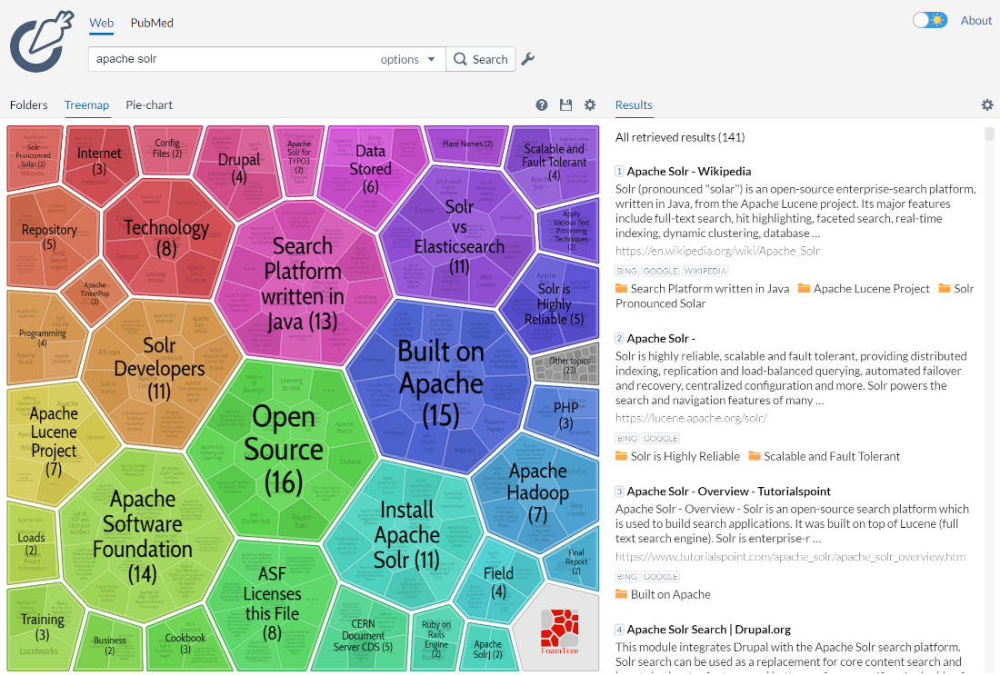

= Result Clustering
// Licensed to the Apache Software Foundation (ASF) under one
// or more contributor license agreements.  See the NOTICE file
// distributed with this work for additional information
// regarding copyright ownership.  The ASF licenses this file
// to you under the Apache License, Version 2.0 (the
// "License"); you may not use this file except in compliance
// with the License.  You may obtain a copy of the License at
//
//   http://www.apache.org/licenses/LICENSE-2.0
//
// Unless required by applicable law or agreed to in writing,
// software distributed under the License is distributed on an
// "AS IS" BASIS, WITHOUT WARRANTIES OR CONDITIONS OF ANY
// KIND, either express or implied.  See the License for the
// specific language governing permissions and limitations
// under the License.

[IMPORTANT]
====
The clustering component implementation and API (parameters) have changed significantly
in version 8.7.0. Please refer to the Solr Guide version matching your Solr release
exactly.
====

The *clustering* (or *cluster analysis*) plugin attempts to automatically discover groups of related search hits (documents) and assign human-readable labels to these groups.

The clustering algorithm in Solr is applied to documents included in search result of each single query -— this is called an _on-line_ clustering.

Clusters discovered for a given query can be perceived as _dynamic facets_. This is beneficial when regular faceting is difficult (field values are not known in advance) or when the queries are exploratory in nature. Take a look at the https://search.carrot2.org/#/search/web/apache%20solr/treemap[Carrot^2^] project's demo page to see an example of search results clustering in action (the groups in the visualization have been discovered automatically in search results to the right, there is no external information involved).

The query issued to the system was _Apache Solr_. It seems clear that faceting could not yield a similar set of groups, although the goals of both techniques are similar—to let the user explore the set of search results and either rephrase the query or narrow the focus to a subset of current documents. Clustering is also similar to <<result-grouping.adoc#result-grouping,Result Grouping>> in that it can help to look deeper into search results, beyond the top few hits.

== Configuration Quick Starter

The clustering extension works as a search component. It needs to be declared and configured in `solrconfig.xml`, for example:

[source,xml]
----
<searchComponent class="org.apache.solr.handler.clustering.ClusteringComponent" name="clustering">
  <lst name="engine">
    <str name="name">lingo</str>
    <str name="clustering.fields">title, content</str>
    <str name="clustering.algorithm">Lingo</str>
  </lst>
</searchComponent>
----

The above declares the clustering component with a single *engine* -- there may be
multiple engines declared and switched at runtime. We will return to the details of
how to configure engines later.

The clustering component must be attached to a `SearchHandler` and explicitly enabled
via property `clustering`. It is important to attach it as the *last* component in the handler's pipeline, as shown below:

[source,xml]
----
  <requestHandler name="/select" class="solr.SearchHandler">
    <lst name="defaults">
      <bool name="clustering">true</bool>
      <str name="clustering.engine">lingo</str>
    </lst>

    <arr name="last-components">
      <str>clustering</str>
    </arr>
  </requestHandler>
----

Once attached, as in the example above, the clustering will be performed automatically
on all documents matching the search handler's query. The clustering extension will take into
account all text fields listed in `clustering.fields` parameter of the engine and will
product a section of the response called `clusters` containing the discovered structure of
groups, for example (JSON response for brevity):

[source,json]
----
{
    "clusters": [
        {
          "labels": ["Memory"],
          "score": 6.80,
          "docs":[ "0579B002",
            "EN7800GTX/2DHTV/256M",
            "TWINX2048-3200PRO",
            "VDBDB1A16",
            "VS1GB400C3"]},
        {
          "labels":["Coins and Notes"],
          "score":28.560285143284457,
          "docs":["EUR",
            "GBP",
            "NOK",
            "USD"]},
        {
          "labels":["TFT LCD"],
          "score":15.355729924203429,
          "docs":["3007WFP",
            "9885A004",
            "MA147LL/A",
            "VA902B"]}
    ]
}
----

The `labels` element of each cluster is a dynamically discovered phrase that describes and applies to all document identifiers under `docs` element.

== Solr Distribution Example

The `techproducts` example included with Solr is pre-configured with all the necessary components for result clustering -- but they are disabled by default.

To enable the clustering component extension and the dedicated search handler configured to use it, specify a JVM System Property when running the example:

[source,bash]
----
bin/solr start -e techproducts -Dsolr.clustering.enabled=true
----

You can now try out the clustering handler by opening the following URL in a browser:

`\http://localhost:8983/solr/techproducts/clustering?q=\*:*&rows=100&wt=xml`

The output XML should include search hits and an array of automatically discovered clusters at the end, resembling the output shown here:

[source,xml]
----
<response>
  <lst name="responseHeader">
    <int name="status">0</int>
    <int name="QTime">299</int>
  </lst>
  <result name="response" numFound="32" start="0" maxScore="1.0">
    <doc>
      <str name="id">GB18030TEST</str>
      <str name="name">Test with some GB18030 encoded characters</str>
      <arr name="features">
        <str>No accents here</str>
        <str>这是一个功能</str>
        <str>This is a feature (translated)</str>
        <str>这份文件是很有光泽</str>
        <str>This document is very shiny (translated)</str>
      </arr>
      <float name="price">0.0</float>
      <str name="price_c">0,USD</str>
      <bool name="inStock">true</bool>
      <long name="_version_">1448955395025403904</long>
      <float name="score">1.0</float>
    </doc>

    <!-- more search hits, omitted -->
  </result>

  <arr name="clusters">
    <lst>
      <arr name="labels">
        <str>DDR</str>
      </arr>
      <double name="score">3.9599865057283354</double>
      <arr name="docs">
        <str>TWINX2048-3200PRO</str>
        <str>VS1GB400C3</str>
        <str>VDBDB1A16</str>
      </arr>
    </lst>
    <lst>
      <arr name="labels">
        <str>iPod</str>
      </arr>
      <double name="score">11.959228467119022</double>
      <arr name="docs">
        <str>F8V7067-APL-KIT</str>
        <str>IW-02</str>
        <str>MA147LL/A</str>
      </arr>
    </lst>

    <!-- More clusters here, omitted. -->

    <lst>
      <arr name="labels">
        <str>Other Topics</str>
      </arr>
      <double name="score">0.0</double>
      <bool name="other-topics">true</bool>
      <arr name="docs">
        <str>adata</str>
        <str>apple</str>
        <str>asus</str>
        <str>ati</str>
        <!-- other unassigned document IDs here -->
      </arr>
    </lst>
  </arr>
</response>
----

A few clusters discovered for this query (`\*:*`), separate all search hits into various categories: DDR, iPod, Hard Drive, etc. Each cluster has a label and score that indicates the "goodness" of the cluster. The score is algorithm-specific and is meaningful only in relation to the scores of other clusters in the same set. In other words, if cluster _A_ has a higher score than cluster _B_, cluster _A_ should be of better quality (have a better label and/or more coherent document set). Each cluster has an array of identifiers of documents belonging to it. These identifiers correspond to the `uniqueKey` field declared in the schema.

Sometimes cluster labels may not make much sense (this depends on many factors -- text in clustered fields, number of documents, algorithm paramerters). Also, some documents may be left out and not be clustered at all; these will be assigned to the synthetic _Other Topics_ group, marked with the `other-topics` property set to `true` (see the XML dump above for an example). The score of the other topics group is zero.

== Installation

The clustering contrib extension requires `dist/solr-clustering-*.jar` and all JARs under `contrib/clustering/lib`.

You can include the required contrib JARs in `solrconfig.xml` as shown below (by default paths are relative to the Solr core so they may need adjustments to your configuration, or an explicit specification of the `$solr.install.dir`):

[source,xml]
----
<lib dir="${solr.install.dir:../../..}/contrib/clustering/lib/" regex=".*\.jar" />
<lib dir="${solr.install.dir:../../..}/dist/" regex="solr-clustering-\d.*\.jar" />
----

== Configuration

=== Component Configuration

The following properties control `ClusteringComponent` state.

`clustering`::
The component is by default disabled, even if properly declared and attached to a search handler. The `clustering` property must be set to `true` to enable it (this can be done by setting
   up default parameters in the search handler -- see below).

`clustering.engine`::
Declares which engine to use. If not present, the first declared active engine is used.

=== Clustering Engines

The declaration of clustering component in `solrconfig.xml` must include one or more predefined configurations called _engines_. For example, consider the configuration below:

[source,xml]
----
<searchComponent class="org.apache.solr.handler.clustering.ClusteringComponent" name="clustering">
  <lst name="engine">
      <str name="name">lingo</str>
      <str name="clustering.algorithm">Lingo</str>
      <str name="clustering.fields">title, content</str>
  </lst>

  <lst name="engine">
      <str name="name">stc</str>
      <str name="clustering.algorithm">STC</str>
      <str name="clustering.fields">title</str>
  </lst>
</searchComponent>
----

This declares two separate engines (`lingo` and `stc`): these configurations have a
different clustering algorithm, and a different set of clustered document fields. The
active engine can be selected by passing `clustering.engine=_name_` parameter
at runtime (via URL) or as the default within the search handler's configuration,
as shown below:

[source,xml]
----
<requestHandler name="/clustering" class="solr.SearchHandler">
  <lst name="defaults">
    <!-- Clustering component enabled. -->
    <bool name="clustering">true</bool>
    <str name="clustering.engine">stc</str>

    <!-- Cluster the top 100 search results - bump up the 'rows' parameter. -->
    <str name="rows">100</str>
  </lst>

  <!-- Append clustering at the end of the list of search components. -->
  <arr name="last-components">
    <str>clustering</str>
  </arr>
</requestHandler>
----

Engines can be configured using a number of parameters described below.

`clustering.algorithm`::
The clustering algorithm is the actual logic (implementation) that discovers relationships among the documents and forms human-readable cluster labels. This parameter sets the name of the clustering algorithm this engine is going to use. Algorithms are supplied to Solr via Carrot^2^-defined service extension. By default, the following open-source algorithms should be available: `Lingo`, `STC`, `Bisecting K-Means`. A commercial clustering algorithm `Lingo3G` plugs into the same extension point and can be used, if it is available on classpath.
[NOTE]
====
The clustering component lists all available algorithms, languages and algorithm-language compatibility at startup. You can peek at startup logs to see what's available
in your Solr installation.
====

`clustering.fields`::
A comma (or space) separated list of text fields which should contain the text
content for clustering. At least one field must be provided. The fields are separate from search handler's `fl` parameter so that clustered fields don't have to be included in the response.

`clustering.language`::
Name of the default language to use for clustering. The default value of this field is `English`. The provided language must be available and the clustering algorithm must support it.

`clustering.languageField`::
Name of the document field that stores the document's language. If the field does not exist
for a document or the value is blank, the default language is used.

`clustering.maxLabels`::
Maximum number of returned cluster labels (if the algorithm returns more labels, the list will
be truncated). By default all labels are returned.

`clustering.includeSubclusters`::
If `true`, sub-clusters are included in the response for algorithms that support hierarchical
clustering. `false` causes only top-level clusters to be returned.

`clustering.includeOtherTopics`::
If `true`, a synthetic cluster called _Other Topics_, consisting of all documents not assigned to any other cluster is formed and returned. The default value of this parameter is `true` but if
  there is no need for this synthetic cluster, it can be set to `false`.

`clustering.resources`::
Location of algorithm-specific resources and configuration files (stop words, other lexical resources, default settings). By default this property is `null` and all resources are read
from their respective algorithm default resource pool (JARs). If this property is not null,
it resolves relative to Solr core's configuration directory.

=== A Note on Choosing the Clustering Algorithm

The question of which algorithm to choose depends on the amount of traffic, the expected result, and the input data (each algorithm will cluster the input slightly differently). There is no one answer which algorithm is "the best": Lingo3G provides hierarchical clusters, Lingo and STC provide flat clusters. STC is faster than Lingo, but arguably produces less intuitive clusters, Lingo3G is the fastest algorithm but is not free or open source... Experiment and pick one that suits your needs.

For a comparison of characteristics of these algorithms see the following links:

* https://carrot2.github.io/release/4.0.4/doc/algorithms/
* https://carrotsearch.com/lingo3g-comparison.html

// TODO: continue from here.

=== Full Field and Query-Context (Snippet) Clustering

The clustering engine can apply clustering to the full content of (stored) fields or it can run an internal highlighter pass to extract context-snippets before clustering. Highlighting is recommended when the logical snippet field contains a lot of content (this would affect clustering performance). Highlighting can also increase the quality of clustering because the content passed to the algorithm will be more focused around the query (it will be query-specific context). The following parameters control the internal highlighter.

`carrot.produceSummary`::
When `true` the clustering component will run a highlighter pass on the content of logical fields pointed to by `carrot.title` and `carrot.snippet`. Otherwise full content of those fields will be clustered.

`carrot.fragSize`::
The size, in characters, of the snippets (aka fragments) created by the highlighter. If not specified, the default highlighting fragsize (`hl.fragsize`) will be used.

`carrot.summarySnippets`:: The number of summary snippets to generate for clustering. If not specified, the default highlighting snippet count (`hl.snippets`) will be used.

=== Clustering Multilingual Content

The field mapping specification can include a `carrot.lang` parameter, which defines the field that stores http://www.loc.gov/standards/iso639-2/php/code_list.php[ISO 639-1] code of the language in which the title and content of the document are written. This information can be stored in the index based on apriori knowledge of the documents' source or a language detection filter applied at indexing time. All algorithms inside the Carrot2 framework will accept ISO codes of languages defined in https://github.com/carrot2/carrot2/blob/master/core/carrot2-core/src/org/carrot2/core/LanguageCode.java[LanguageCode enum].

The language hint makes it easier for clustering algorithms to separate documents from different languages on input and to pick the right language resources for clustering. If you do have multi-lingual query results (or query results in a language different than English), it is strongly advised to map the language field appropriately.

`carrot.lang`::
The field that stores ISO 639-1 code of the language of the document's text fields.

`carrot.lcmap`::
A mapping of arbitrary strings into ISO 639 two-letter codes used by `carrot.lang`. The syntax of this parameter is the same as `langid.map.lcmap`, for example: `langid.map.lcmap=japanese:ja polish:pl english:en`

The default language can also be set using Carrot2-specific algorithm attributes (in this case the http://doc.carrot2.org/#section.attribute.lingo.MultilingualClustering.defaultLanguage[MultilingualClustering.defaultLanguage] attribute).

== Tweaking Algorithm Settings

The algorithms that come with Solr are using their default settings which may be inadequate for all data sets. All algorithms have lexical resources and resources (stop words, stemmers, parameters) that may require tweaking to get better clusters (and cluster labels). For Carrot2-based algorithms it is probably best to refer to a dedicated tuning application called Carrot2 Workbench (screenshot below). From this application one can export a set of algorithm attributes as an XML file, which can be then placed under the location pointed to by `carrot.resourcesDir`.

image::images/result-clustering/carrot2-workbench.png[image,scaledwidth=75.0%]

=== Providing Defaults for Clustering

The default attributes for all engines (algorithms) declared in the clustering component are placed under `carrot.resourcesDir` and with an expected file name of `engineName-attributes.xml`. So for an engine named `lingo` and the default value of `carrot.resourcesDir`, the attributes would be read from a file in `conf/clustering/carrot2/lingo-attributes.xml`.

An example XML file changing the default language of documents to Polish is shown below.

[source,xml]
----
<attribute-sets default="attributes">
  <attribute-set id="attributes">
    <value-set>
      <label>attributes</label>
      <attribute key="MultilingualClustering.defaultLanguage">
        <value type="org.carrot2.core.LanguageCode" value="POLISH"/>
      </attribute>
    </value-set>
  </attribute-set>
</attribute-sets>
----

=== Tweaking Algorithms at Query-Time

The clustering component and Carrot2 clustering algorithms can accept query-time attribute overrides. Note that certain things (for example lexical resources) can only be initialized once (at startup, via the XML configuration files).

An example query that changes the `LingoClusteringAlgorithm.desiredClusterCountBase` parameter for the Lingo algorithm:

[source,text]
http://localhost:8983/solr/techproducts/clustering?q=*:*&rows=100&LingoClusteringAlgorithm.desiredClusterCountBase=20

The clustering engine (the algorithm declared in `solrconfig.xml`) can also be changed at runtime by passing `clustering.engine=name` request attribute:

[source,text]
http://localhost:8983/solr/techproducts/clustering?q=*:*&rows=100&clustering.engine=kmeans

== Performance Considerations with Dynamic Clustering

Dynamic clustering of search results comes with two major performance penalties:

* Increased cost of fetching a larger-than-usual number of search results (50, 100 or more documents),
* Additional computational cost of the clustering itself.

For simple queries, the clustering time will usually dominate the fetch time. If the document content is very long the retrieval of stored content can become a bottleneck. The performance impact of clustering can be lowered in several ways:

* feed less content to the clustering algorithm by enabling `carrot.produceSummary` attribute,
* perform clustering on selected fields (titles only) to make the input smaller,
* use a faster algorithm (STC instead of Lingo, Lingo3G instead of STC),
* tune the performance attributes related directly to a specific algorithm.

Some of these techniques are described in _Apache SOLR and Carrot2 integration strategies_ document, available at http://carrot2.github.io/solr-integration-strategies. The topic of improving performance is also included in the Carrot2 manual at http://doc.carrot2.org/#section.advanced-topics.fine-tuning.performance.

== Additional Resources

The following resources provide additional information about the clustering component in Solr and its potential applications.

* Apache Solr and Carrot2 integration strategies: http://carrot2.github.io/solr-integration-strategies
* Clustering and Visualization of Solr search results (Berlin BuzzWords conference, 2011): http://2011.berlinbuzzwords.de/sites/2011.berlinbuzzwords.de/files/solr-clustering-visualization.pdf
